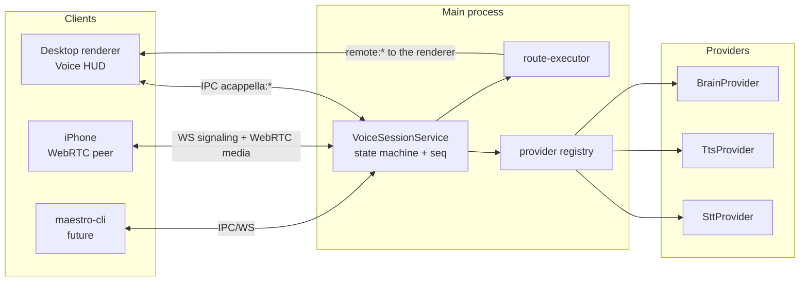
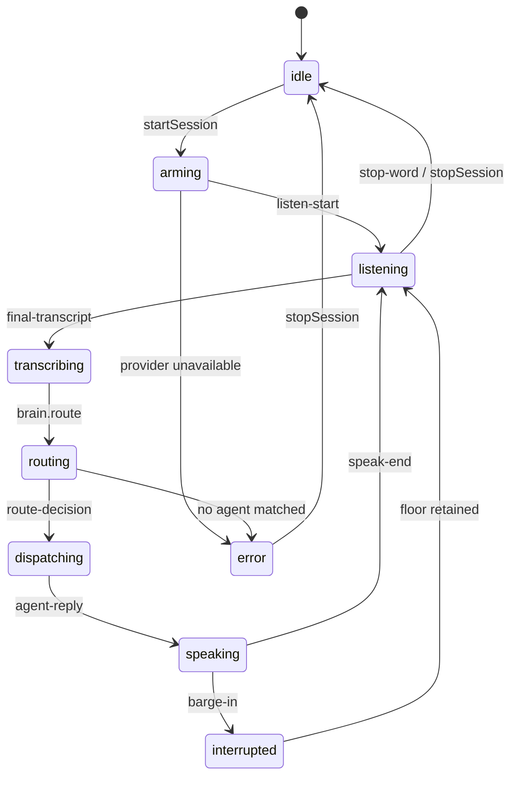

# A Cappella System Overview

A Cappella turns Maestro into something you talk to. You say "start a new tab on the backend
agent about the auth refactor" and a correctly named tab appears on the right agent, primed with
the prompt. The agent answers, and the answer is spoken back in conversational form rather than
read out as raw terminal output.

This document describes the skeleton that Phase 01 lands. Everything real that arrives later
(Whisper, Kokoro, OpenAI Realtime, ElevenLabs, the iPhone leg) drops in behind the interfaces
named here.

## The one architectural rule

**The voice session lives in the MAIN process and is transport-agnostic.**

The desktop renderer is a client of the session. The iPhone will be a second client on the same
protocol, not a port of the desktop UI. Nothing in the session service may reference a
`BrowserWindow`, a React store, or the DOM. The rationale is recorded in
[[adr-002-main-process-session]].

## Surveyed precedent

Phase 01 is built on top of code that already exists. The survey below records what was read and
what each piece contributes.

| Existing code                                                   | What it contributes                                                                                                                                                                                                                                                                                             |
| --------------------------------------------------------------- | --------------------------------------------------------------------------------------------------------------------------------------------------------------------------------------------------------------------------------------------------------------------------------------------------------------- |
| `src/renderer/hooks/utils/useVoiceInput.ts`                     | Web Speech dictation for the AI composer on touch devices. It appends a transcript to a draft; it has no session, no routing, and no speech out. A Cappella eventually subsumes it, but it stays until the local STT tier lands.                                                                                |
| `src/main/global-hotkey-manager.ts`                             | A singleton owning exactly one system-wide accelerator (`setGlobalShowHotkey`). Push-to-talk needs a second binding, so Phase 06 generalizes this from a singleton into a registry.                                                                                                                             |
| `src/main/app-lifecycle/cadenza-hud-window.ts`                  | The precedent for an auxiliary always-on-top window: transparent, frameless, `focusable: false`, click-through by default, hover hit-testing polled in main because `setIgnoreMouseEvents(..., { forward: true })` is unsupported on Linux. A floating voice HUD that survives app-switching reuses this shape. |
| `src/main/plugins/consent-window.ts`                            | The precedent for a dedicated auxiliary window with its OWN minimal preload and page, so a surface cannot reach the full IPC bridge.                                                                                                                                                                            |
| `src/main/web-server/routes/wsRoute.ts`                         | The authenticated WebSocket at `/$TOKEN/ws`. Clients connect with an optional `?sessionId=`, receive a `connected` frame, then an initial state sync. The phone's WebRTC signaling rides this socket, so it inherits the existing token auth instead of opening a second listener.                              |
| `src/main/web-server/services/broadcastService.ts`              | `broadcastToAll` / `broadcastToSession` over the connected client map. The fan-out shape the voice event stream copies for non-IPC clients.                                                                                                                                                                     |
| `src/shared/plugins/first-party.ts`                             | The Encore feature registry, keyed by Encore flag, carrying an honest broker-permission disclosure and any supervised background services.                                                                                                                                                                      |
| `src/renderer/components/Settings/Extensions/extensionModel.ts` | Projects first-party definitions into marketplace tiles; `beta` is a presentation concern that lives here, not in the shared registry.                                                                                                                                                                          |

## Where tab state actually lives

This is the constraint that shapes the dispatch executor, and it is easy to get wrong.

**Main has no tab authority.** Tab state lives in the renderer. Even a web or CLI request to open
a tab is forwarded to the renderer for execution: `src/main/web-server/callbacks/tabCallbacks.ts`
sends `remote:newTab`, `remote:selectTab`, `remote:renameTab`, `remote:closeTab` and, for the
create case, waits on a one-shot `remote:newTab:response:<uuid>` channel with a 5 second timeout.
`src/main/ipc/handlers/tabs.ts` exists only so the renderer can report a close back to main.

So `executeRouteDecision()` does not create tabs. It resolves a decision into the same
`remote:*` messages the web server already uses, and reads its roster from the persisted
sessions store (`sessionsStore.get<StoredSession[]>('sessions', [])`, the same source
`registerSessionCallbacks` uses). Hand-rolling a parallel tab creation path in main would produce
tabs the renderer does not know about.

The corollary for the phone: the iPhone never talks to tabs either. It sends a voice event, main
routes it, and the renderer performs it. One execution path, three possible originators.

### What the executor actually does

`src/main/acappella/dispatch/route-executor.ts` maps each `tabAction` onto one existing channel:

| Decision             | Channel(s)                                                         | Reported action |
| -------------------- | ------------------------------------------------------------------ | --------------- |
| `new` with a prompt  | `remote:newAITabWithPrompt`, then `remote:renameTab` for `tabName` | `created`       |
| `new` with no prompt | `remote:newTab`, then `remote:renameTab`                           | `created`       |
| `current`            | `remote:selectSession`, then `remote:executeCommand`               | `focused`       |
| `recall`             | `remote:selectSession`, then `remote:executeCommand`               | `recalled`      |

Creation and prompt delivery are one atomic renderer operation because a separate create-then-send
leaves an orphan tab behind whenever the send is dropped. The `dispatch` event is emitted only
after the renderer answers, so "opened a new tab named Auth Refactor on agent Backend" is a report,
not a hope.

Four rules the executor holds to, all of them about refusing to guess:

- **The roster is re-read at dispatch time**, not carried over from routing. The user can close a
  tab while a decision is in flight, and the fresh read is the authority.
- **A recalled tab that is gone is a `dispatch-failed`**, never a quiet landing in some other tab.
  Recall is a promise to return somewhere specific.
- **A `conductor` target resolves to the session's bound agent, then the agent the desktop is
  showing, then the only agent there is.** With several agents and no signal, it fails: a spoken
  instruction in the wrong repository is worse than an error.
- **A rejected delivery receipt is a failure, not a `promptSent: false` footnote.** The session
  holds the floor open waiting for a reply, so a dropped prompt has to be reported as one.

The renderer round trip sits behind a `VoiceRendererBridge` interface, for the same reason the
session service takes its providers injected: the routing rules are testable without an Electron
window, and the phone leg gets the same executor with a different bridge.

## Provider tiers

A Cappella supports two fundamentally different pipeline shapes behind one set of interfaces.

### Cascade tier (STT then Brain then TTS)

Three independent providers, swappable individually:

- `SttProvider`: streaming `feed(pcm)` with `partial` and `final` callbacks.
- `BrainProvider`: `route(input, context)` returns a `RouteDecision`; `converse(agentText, context)`
  reshapes an agent's terminal-shaped answer into spoken-form text.
- `TtsProvider`: `speak(text)` returns an async iterable of audio chunks, plus `cancel()`.

The cascade tier is the default because each stage is independently substitutable: local Whisper
with cloud TTS, or a cloud brain with local everything else. Latency is the sum of the stages,
which is why barge-in matters so much (see below).

### Realtime tier (speech to speech)

A single provider owns microphone audio in and speaker audio out, with routing expressed as tool
calls. Latency is far lower and prosody is far better, but the stages are no longer separable and
the audio must leave the machine.

The realtime tier implements the same three interfaces as a **fused adapter**: `SttProvider`
emits transcripts the realtime session already produces, `BrainProvider.route()` maps to the
session's tool-call channel, and `TtsProvider` becomes a passthrough. The session service cannot
tell the tiers apart, which is the point.

### Provider resolution rules

`src/main/acappella/providers/provider-registry.ts` resolves the active trio from settings, and is
the only module allowed to import a concrete provider. Two rules are non-negotiable:

1. When nothing is configured, resolve the **mock** trio. The pipeline must always be runnable.
2. **Never silently substitute a cloud provider for a missing local one.** If the user asked for
   local Whisper and the model is not downloaded, the role falls back to the mock and the
   resolution carries a `VoiceProviderSubstitution` naming what was asked for, what is running, and
   why. That record is logged and handed to the caller to put in front of the user; it is never a
   quiet upload of their microphone to a vendor.

The fallback is always the mock for that role. There is no search over the catalog that could land
on a different tier, which is what makes rule 2 structural rather than a promise.

## Client model

Both clients are peers on [[voice-session-protocol]]. Neither owns session state.

|                  | Desktop renderer                                                                                                                       | iPhone                                                                                             |
| ---------------- | -------------------------------------------------------------------------------------------------------------------------------------- | -------------------------------------------------------------------------------------------------- |
| Transport        | Electron IPC (`acappella:*` plus a push `acappella:event` channel)                                                                     | Authenticated WebSocket for signaling, WebRTC for media                                            |
| Audio capture    | Local device, or none in dev-harness mode                                                                                              | Device microphone over WebRTC                                                                      |
| Responsibilities | Render HUD state, transcript, dispatch narration; send `submitUtterance` / `interrupt` / `stopWord`; execute `remote:*` tab operations | Capture and play audio, render the project wheel from `agent-roster`, send the same three commands |
| State ownership  | None. Mirrors the event stream into `voiceSessionStore`.                                                                               | None.                                                                                              |

Because clients only mirror, a client can join mid-session and catch up: it reads `get-state` and
`get-roster`, then follows `seq` for gaps. A gap means the client missed events and should
re-read state rather than guess.

Transport choice for the phone leg is argued in [[adr-001-webrtc-transport]].

The desktop transport is `src/main/ipc/handlers/acappella.ts` plus the `window.maestro.voice.*`
preload namespace. Its channel table and the four properties that binding has to hold (lazy
construction, broadcast fan-out, the `ACappellaDisabled` gate, and a null snapshot before the
first start) are in [[voice-session-protocol]].

## Session lifecycle and the state machine

States: `idle | arming | listening | transcribing | routing | dispatching | speaking | interrupted | error`.

The legal transitions live in a `VOICE_STATE_TRANSITIONS` table in
`src/shared/acappella/session-state.ts`. An illegal transition throws rather than smearing state,
because a voice UI that is silently in two states at once is unfixable in the field.

### Barge-in and stop are different

This distinction is load-bearing and every phase inherits it:

- **Barge-in** cancels TTS and **keeps the floor**. The session goes `speaking -> interrupted ->
listening`. You talked over the assistant; it shuts up and keeps listening.
- **Stop word** ends the session and returns to `idle`. The floor is released.

Conflating them produces the single most annoying failure mode in voice interfaces: interrupting
the assistant hangs up on it.

## Error policy

Per the repo's Sentry policy, unexpected exceptions bubble. Only known failure modes are
classified into `session-error` events:

- `provider-unavailable`: a configured provider cannot start (model missing, no API key, device
  busy).
- `no-agent-matched`: the brain could not resolve a target and the conductor fallback is disabled.
- `dispatch-failed`: the renderer did not answer a `remote:newTab` within its timeout.

Anything else is a bug and should reach Sentry with context.

Two places have no caller to bubble to, so they report explicitly instead of rethrowing: the turn
pipeline (which runs from an STT callback) and the speech run (whose only caller is the reply
seam, and from there an IPC handler). Both call `captureException` with the session context, emit
`listen-stop(error)`, and park the session in `error`. Swallowing is not the point: an escaping
rejection there would reach the process handler stripped of session context AND leave the session
holding a floor nothing will ever hand back, which reads to the user as a frozen HUD.

## What Phase 01 deliberately does not do

- No network calls, no API keys, no model downloads. The mock tier proves the pipeline end to end.
- Enabling the Encore flag opens no device and starts no service. It only makes the Voice Setup
  surface reachable.
- No WebRTC yet. The transport decision is recorded now so the protocol is designed for it, but
  the phone leg is a later phase.

## Related

- [[voice-session-protocol]] - every event, payload, and direction.
- [[adr-001-webrtc-transport]] - why WebRTC beats WebSocket plus Opus for the phone leg.
- [[adr-002-main-process-session]] - why the session is headless in main.
