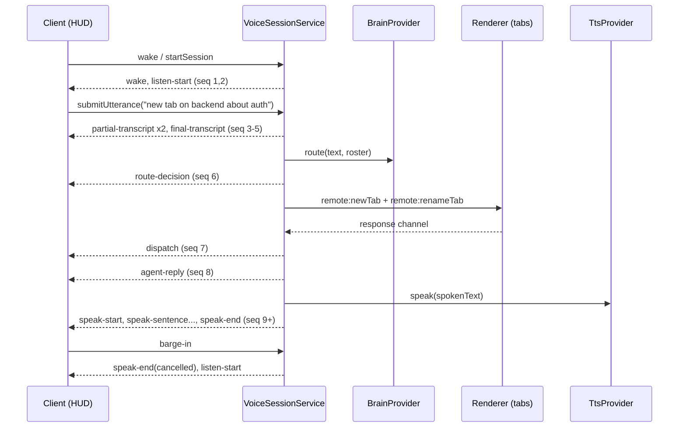

# Voice Session Protocol

The protocol is the contract between the headless session service in the main process and every
client (desktop renderer today, iPhone later, CLI if it ever wants in). It is defined in
`src/shared/acappella/protocol.ts` as a discriminated union on `type`.

The protocol is deliberately transport-agnostic. The same object graph travels over Electron IPC
(`acappella:event`) and over the authenticated WebSocket at `/$TOKEN/ws`. Nothing in it may refer
to a `BrowserWindow`, a DOM node, or a React store. See [[adr-002-main-process-session]].

## Envelope

Every event carries the same three fields:

```ts
interface VoiceEventBase {
	/** The voice session this event belongs to. Not an agent id. */
	sessionId: string;
	/** Monotonic per voice session, starting at 1. A gap means events were lost. */
	seq: number;
	/** Emission time, epoch ms. */
	ts: number;
}
```

`sessionId` is the **voice** session id, minted by `startSession()`. It is not an agent id and it
is not a provider session id. When a voice session is bound to an agent, the agent id travels in
the scope, never in `sessionId`.

`seq` exists so a client can detect gaps. It is monotonic and per voice session, incremented by
the service for every emitted event regardless of subscriber count. A client that sees `seq` jump
must not interpolate: it re-reads `acappella:get-state` and `acappella:get-roster` and resumes.

## Direction

`client -> service` events are commands. `service -> client` events are announcements, fanned out
to every subscriber so two clients watching the same session see identical state.

Four events travel **both** ways (`wake`, `final-transcript`, `barge-in`, `stop-word`). When a
client sends one, the service validates it against the
state machine and, if it is legal, echoes it outward with a fresh `seq` so every other client sees
it. The echoed copy is the authoritative one; a client must render its own optimistic state only
until the echo lands.

## Event catalogue

| Event                | Direction         | Emitted when                                                                       |
| -------------------- | ----------------- | ---------------------------------------------------------------------------------- |
| `wake`               | both              | A wake word or push-to-talk key fires on a client, then echoed as the session arms |
| `listen-start`       | service -> client | The floor opens and audio is being consumed                                        |
| `listen-stop`        | service -> client | The floor closes (endpointed, stopped, or interrupted)                             |
| `partial-transcript` | service -> client | STT produces an interim hypothesis                                                 |
| `final-transcript`   | both              | STT settles an utterance; inbound when the client owns STT                         |
| `route-decision`     | service -> client | The brain resolves a target, tab action, and prompt                                |
| `dispatch`           | service -> client | The decision was executed against a real agent and tab                             |
| `agent-reply`        | service -> client | The agent produced text worth speaking                                             |
| `speak-start`        | service -> client | TTS begins a reply                                                                 |
| `speak-sentence`     | service -> client | One sentence of the reply is spoken                                                |
| `speak-end`          | service -> client | TTS finishes or is cancelled                                                       |
| `barge-in`           | both              | The user speaks or clicks over active speech                                       |
| `stop-word`          | both              | The stop word or Stop button ends the session                                      |
| `session-error`      | service -> client | A classified, known failure mode                                                   |
| `tab-state`          | service -> client | The bound agent's tab set or active tab changes                                    |
| `agent-roster`       | service -> client | Roster snapshot, on subscribe and on change                                        |

## Payloads

### `wake` (both)

```ts
{
	type: 'wake';
	source: 'wake-word' | 'hotkey' | 'client-button';
	scope: VoiceScope;
}
```

`VoiceScope` is `{ kind: 'conductor' }` or `{ kind: 'agent'; sessionId: string }`, where that
`sessionId` is an **agent** id. Inbound, `wake` requests a session in that scope. Outbound, it
announces `idle -> arming`.

### `listen-start` (service -> client)

```ts
{
	type: 'listen-start';
	scope: VoiceScope;
	sttProviderId: string;
}
```

State becomes `listening`. `sttProviderId` lets the HUD show which tier is active (`mock`,
`whisper-local`, `openai-realtime`, ...), which matters because provider substitution is never
silent.

### `listen-stop` (service -> client)

```ts
{
	type: 'listen-stop';
	reason: 'endpoint' | 'stopped' | 'interrupted' | 'error';
}
```

### `partial-transcript` (service -> client)

```ts
{
	type: 'partial-transcript';
	text: string;
	stability: number;
}
```

`text` is the full hypothesis so far, not a delta, so a client that missed one partial still
renders correctly. `stability` is 0 to 1; the mock STT emits two partials with rising stability
before the final.

### `final-transcript` (both)

```ts
{ type: 'final-transcript'; text: string; confidence: number; durationMs?: number }
```

Outbound in the cascade tier. **Inbound** when a client owns transcription, which is exactly the
iPhone case if on-device dictation ever beats the desktop pipeline. Either way it lands on the
same seam as `submitUtterance(text)`, so the dev harness and a real microphone are
indistinguishable to everything downstream.

### `route-decision` (service -> client)

```ts
{
	type: 'route-decision';
	decision: RouteDecision;
	brainProviderId: string;
	latencyMs: number;
}
```

`RouteDecision` is defined in `src/shared/acappella/route-decision.ts`:

```ts
{
	target: 'conductor' | { sessionId: string };
	tabAction: 'current' | 'new' | 'recall';
	tabId?: string;
	tabName?: string;
	prompt: string;
	confidence: number;
}
```

The same file exports a JSON Schema constant for this shape. Phase 07 compiles that schema into a
GBNF grammar so a local model is structurally incapable of emitting an invalid decision. Keeping
the schema next to the type is what makes that possible without a second, drifting definition.

### `dispatch` (service -> client)

```ts
{
	type: 'dispatch';
	agentSessionId: string;
	agentName: string;
	tabId: string;
	tabName?: string;
	action: 'focused' | 'created' | 'recalled';
	promptSent: boolean;
}
```

This is what lets any client narrate "opened a new tab named Auth Refactor on agent Backend". It
is emitted **after** the renderer confirms the operation, not when it is requested, because tab
creation is a round trip that can time out (see [[system-overview]], "Where tab state actually
lives").

### `agent-reply` (service -> client)

```ts
{
	type: 'agent-reply';
	agentSessionId: string;
	tabId: string;
	text: string;
	spokenText: string;
}
```

`text` is what the agent actually wrote. `spokenText` is `BrainProvider.converse()` output: the
same content reshaped for the ear, because reading a diff aloud is useless. Clients that show a
transcript should show `text` and speak `spokenText`.

### `speak-start` / `speak-sentence` / `speak-end` (service -> client)

```ts
{
	type: 'speak-start';
	utteranceId: string;
	sentenceCount: number;
	ttsProviderId: string;
}
{
	type: 'speak-sentence';
	utteranceId: string;
	index: number;
	text: string;
}
{
	type: 'speak-end';
	utteranceId: string;
	reason: 'complete' | 'cancelled' | 'error';
}
```

`utteranceId` scopes a speech run so a late `speak-sentence` from a cancelled run can be dropped
rather than rendered after the next reply started. Sentence granularity is what makes barge-in
feel instant: the client already knows the sentence boundary it was cut at.

### `barge-in` (both)

```ts
{ type: 'barge-in'; source: 'voice' | 'client-button'; cancelledUtteranceId?: string }
```

Cancels TTS and **keeps the floor**: `speaking -> interrupted -> listening`. It does not end the
session. This is the difference that makes the interface usable.

### `stop-word` (both)

```ts
{ type: 'stop-word'; phrase?: string; source: 'voice' | 'client-button' }
```

Ends the session: any state `-> idle`. TTS is cancelled, the floor is released, providers are torn
down.

### `session-error` (service -> client)

```ts
{
	type: 'session-error';
	code: 'provider-unavailable' | 'no-agent-matched' | 'dispatch-failed';
	message: string;
	recoverable: boolean;
	providerId?: string;
}
```

The union is closed on purpose. Only classified, known failure modes become events; anything else
bubbles to Sentry per the repo error policy. A new code means a new, deliberately handled failure
mode, not a catch-all.

### `tab-state` (service -> client)

```ts
{ type: 'tab-state'; agentSessionId: string; tabs: RosterTab[]; activeTabId: string | null }
```

### `agent-roster` (service -> client)

```ts
{ type: 'agent-roster'; agents: RosterAgent[] }

interface RosterAgent {
	sessionId: string;
	name: string;
	agentType: string;
	cwd: string;
	tabs: RosterTab[];
}

interface RosterTab {
	id: string;
	name: string | null;
	lastActiveAt: number | null;
}
```

The roster is the brain's routing context and, later, the phone's project wheel. It is built by
`buildAgentRoster()` in `src/main/acappella/dispatch/route-executor.ts` from the main-process
stores via `src/main/stores/getters.ts`, the same source the web server's session callbacks read.
It is deliberately compact: no logs, no usage stats, nothing that would make it expensive to push
on every change or to send to a model as context.

## Flow

A complete turn, with the mock tier:



## Electron IPC binding

The desktop client speaks the protocol over `src/main/ipc/handlers/acappella.ts`, exposed to the
renderer as `window.maestro.voice.*` (`src/main/preload/acappella.ts`). The handlers are
registered from `setupIpcHandlers()` in `src/main/ipc/bootstrap/index.ts`, which is the path the
running app actually takes; `registerAllHandlers()` in `handlers/index.ts` is not called at
runtime, so a handler wired only there would be dead.

| Channel                      | Preload method             | Returns                                                |
| ---------------------------- | -------------------------- | ------------------------------------------------------ |
| `acappella:start-session`    | `voice.start(scope?)`      | `{ snapshot, substitutions }`                          |
| `acappella:stop-session`     | `voice.stop()`             | `void`                                                 |
| `acappella:submit-utterance` | `voice.submitUtterance()`  | `boolean` (false when the state cannot take one)       |
| `acappella:interrupt`        | `voice.interrupt(source)`  | `boolean` (false when nothing is speaking)             |
| `acappella:stop-word`        | `voice.stopWord(payload?)` | `void`                                                 |
| `acappella:get-roster`       | `voice.getRoster()`        | `RosterAgent[]`                                        |
| `acappella:get-state`        | `voice.getState()`         | `VoiceSessionSnapshot`, or null before the first start |
| `acappella:event` (push)     | `voice.onEvent(handler)`   | every `VoiceEvent`, in `seq` order                     |

Four properties of this binding are deliberate:

- **Registration builds nothing.** The service, its provider trio, and the dispatch executor are
  all constructed on the first `start-session`. Enabling the Encore Feature opens no device and
  downloads nothing.
- **Events are broadcast, not addressed.** `acappella:event` goes to every window and to the
  web-desktop bridge through `safeSend`, matching the multi-window invariant in
  `src/main/utils/safe-send.ts`. There is no per-window subscriber list: a client that does not
  want the stream simply does not listen.
- **The Encore gate rejects with `ACappellaDisabled`**, so the renderer can tell "feature off"
  from "no session". `stop-session` is the one ungated channel, because toggling the feature off
  mid-session must still be able to release the floor.
- **`get-state` returns null before the first start.** Synthesising an idle snapshot would have to
  name provider ids that nothing has resolved yet, and reporting a requested-but-unavailable
  provider as the running one is the substitution lie in a different costume.

A provider selection change in settings rebuilds the service on the next start, which is how Voice
Setup takes effect without an app restart.

## Invariants

1. **`seq` is never reused and never goes backwards** within a voice session.
2. **Clients hold no authoritative state.** Every client is a projection of the event stream.
3. **Barge-in keeps the floor; stop releases it.** No event may blur the two.
4. **An illegal state transition throws.** The transition table in `session-state.ts` is the only
   place legality is defined.
5. **No provider substitution is silent.** Every provider-bearing event names its provider id.
6. **The union is closed.** Adding an event means adding it to `protocol.ts`, not stuffing an
   extra field into an existing payload.

## Related

- [[system-overview]] - the service, tiers, and client model.
- [[adr-001-webrtc-transport]] - why the phone's media leg is WebRTC.
- [[adr-002-main-process-session]] - why the session is headless in main.
