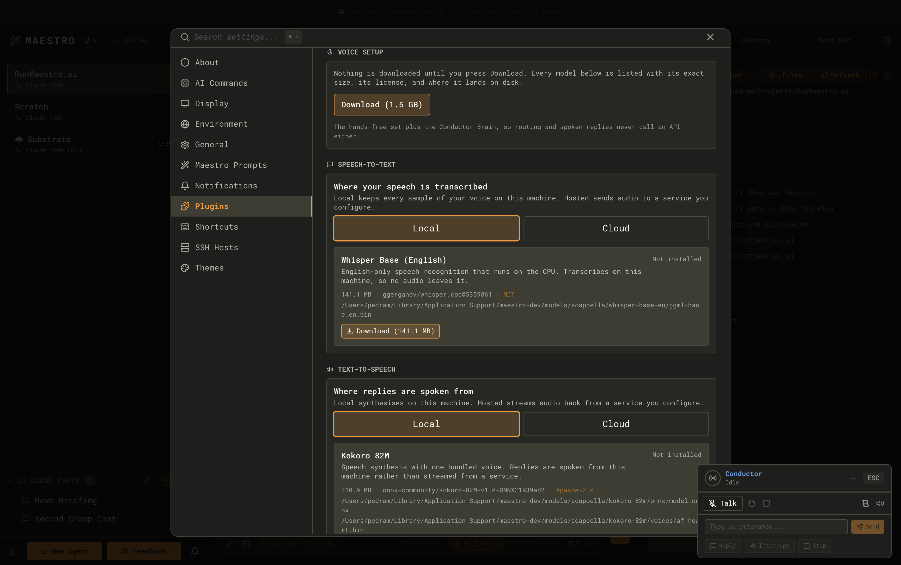
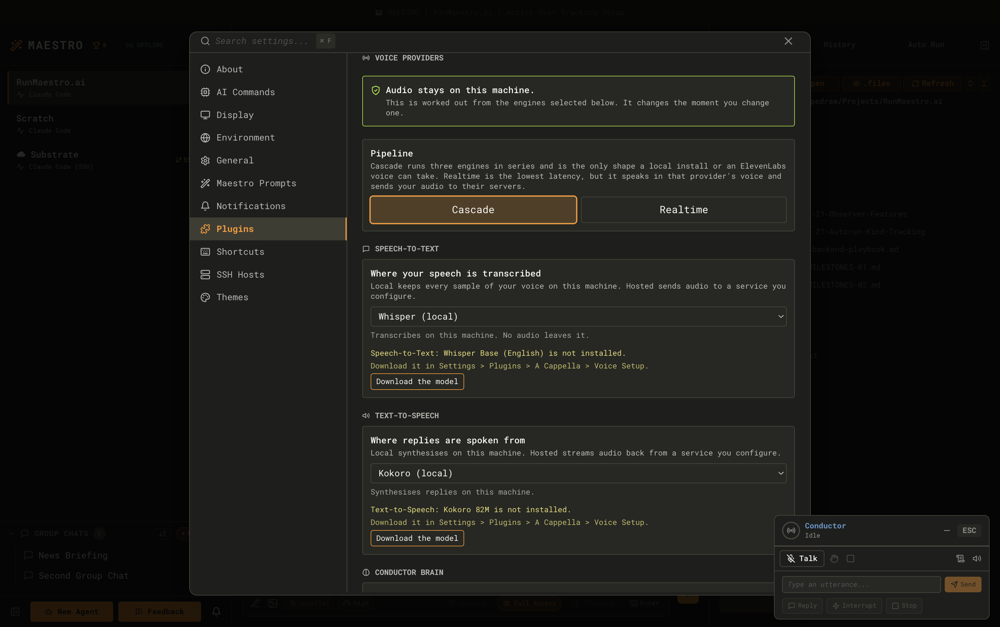
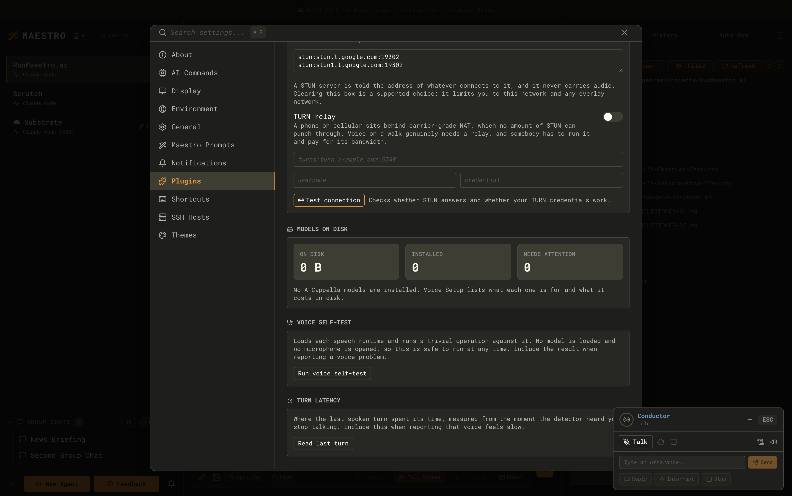
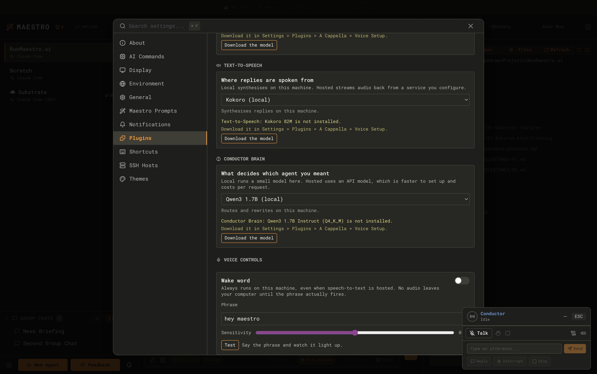
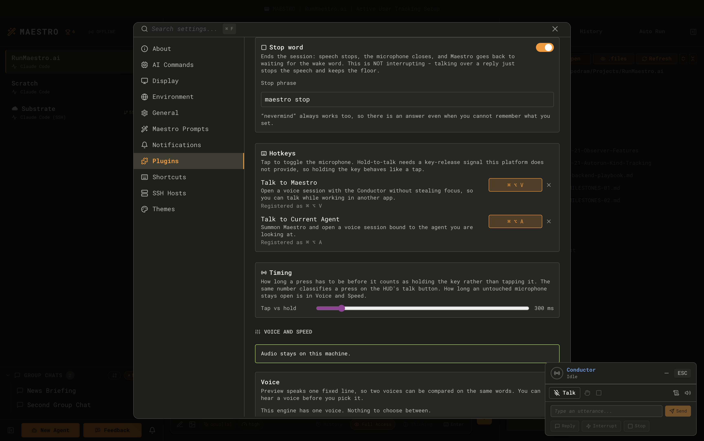
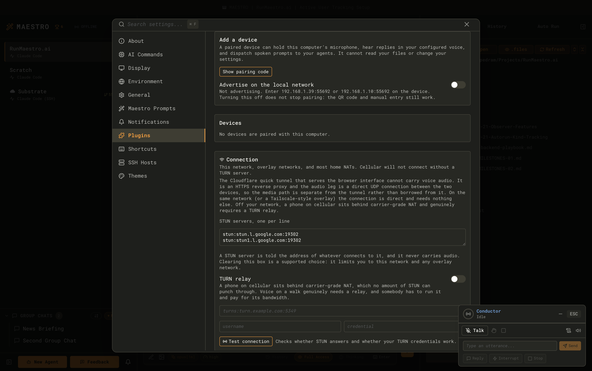

A Cappella is Maestro's voice interface. You say something, Maestro works out which agent and which tab you meant, sends it there, and reads the reply back to you. You can drive it with a wake word, with a global hotkey from inside another application, or from a paired phone across the room.

It is a **front end for the agents you already have**, not a second assistant. It does not think about your code, it does not answer questions itself, and it never invents an agent to talk to. Every utterance ends up in an ordinary Maestro tab that you can scroll back through afterwards.

<Note>
	A Cappella is an **Encore Feature** and it is in **Beta**. It is off by default. While it is off, no
	microphone is opened, no model is downloaded, no hotkey is registered, no Bonjour advert is
	published, and no voice UI renders anywhere in the app.
</Note>

## Turning it on

1. Open **Settings** (`Cmd+,` / `Ctrl+,`) and go to the **Plugins** tab.
2. Find the **A Cappella** card and enable it. A confirmation sheet lists what the feature reads before anything is switched on.
3. Select the card to open its detail pane. The **Settings** sub-tab holds every voice panel: Voice Setup, Voice Providers, Voice Controls, Voice and Speed, Paired Devices, and Models.

Enabling the feature only makes those panels reachable. **Nothing is downloaded and no device is opened until you ask for it**: models arrive when you press Download, and the microphone opens at your first real session.

## Where your audio goes

This is the only question that really matters when you configure a voice assistant, so Maestro computes the answer from your actual selection rather than writing it into help text. The sentence at the top of **Voice Providers** and **Voice and Speed** is derived from the providers you picked, and it updates the moment you change a slot.

There are three independent slots plus one alternative pipeline shape:

| Slot                | What it does                                              | Default |
| ------------------- | --------------------------------------------------------- | ------- |
| **Speech-to-Text**  | Turns what you said into words                            | Local   |
| **Text-to-Speech**  | Turns the reply into sound                                | Local   |
| **Conductor Brain** | Decides which agent and tab you meant, and shapes replies | Local   |

Each slot is configured and validated on its own. A missing Whisper model does not stop you using a hosted Brain, and **no path anywhere silently substitutes one provider for another**. If a slot cannot run, the session refuses with a specific reason instead of quietly routing your microphone somewhere you did not choose.

### The providers, and what leaves your machine

| Provider                               | Slot            | Leaves this machine                       |
| -------------------------------------- | --------------- | ----------------------------------------- |
| Whisper (local)                        | Speech-to-Text  | Nothing                                   |
| OpenAI (hosted)                        | Speech-to-Text  | **Your audio**, to OpenAI                 |
| Kokoro (local)                         | Text-to-Speech  | Nothing                                   |
| ElevenLabs (hosted)                    | Text-to-Speech  | The reply text, to ElevenLabs             |
| Qwen3 1.7B (local)                     | Conductor Brain | Nothing                                   |
| OpenAI (hosted)                        | Conductor Brain | Your transcripts, to OpenAI               |
| Anthropic (hosted)                     | Conductor Brain | Your transcripts, to Anthropic            |
| Conductor agent                        | Conductor Brain | Nothing new (it runs an agent you set up) |
| Mock providers                         | Any             | Nothing (no microphone, no model)         |
| **OpenAI Realtime** (speech-to-speech) | All three       | **Your audio**, to OpenAI                 |

**Realtime is a pipeline shape, not a fourth slot.** Choosing it replaces all three slots with one speech-to-speech API: the lowest latency available, in exchange for your audio going to OpenAI and the assistant speaking in that provider's voice.

Hosted providers need an API key, entered in **Voice Providers**. Keys are stored per service and validated when you add them.

<Note>
	The **wake word is always local and never optional**. While only the wake detector is running, no
	audio frame reaches a hosted provider, whichever speech-to-text engine you picked. That is enforced
	in the type system and re-checked at runtime, not left to discipline.
</Note>

### The Conductor agent option

The Conductor Brain can also be a real Maestro agent instead of a model. It is slower than the other options, and in exchange it can reason about your actual projects when deciding where an utterance belongs. Nothing new leaves your machine: it runs an agent you already configured, wherever you already configured it to run.

## Downloading the models

Local providers need model files. **Voice Setup** lists every one with its exact size, license, source repository, and install path before it downloads anything, and mounting the panel makes zero network calls.

| Model                        | Role            | Size     | License    |
| ---------------------------- | --------------- | -------- | ---------- |
| Whisper Base (English)       | Speech-to-Text  | 141.1 MB | MIT        |
| openWakeWord Base            | Wake word       | 2.3 MB   | Apache-2.0 |
| Kokoro 82M                   | Text-to-Speech  | 310.9 MB | Apache-2.0 |
| Qwen3 1.7B Instruct (Q4_K_M) | Conductor Brain | 1.0 GB   | Apache-2.0 |

Voice Setup offers them as two bundles, and the button always shows the total of what is still **missing** rather than the size of the whole set:

- **Hands-free (local)** - Whisper, openWakeWord, and Kokoro. **454.4 MB.** Everything the microphone touches stays on this machine.
- **Fully local** - the above plus the Conductor Brain. **1.5 GB.** Routing and spoken replies never call an API either.

Every file is downloaded from a pinned revision and checked against a SHA-256 recorded in the app, so a model that was tampered with in transit fails to install rather than quietly running.

### Disk usage and getting the space back

Models install under `models/acappella` inside Maestro's user data directory. The **Models** page shows the total footprint, each model's size, when it was installed, and when it was last verified, with **Remove** and **Re-verify** next to each one.

When you switch A Cappella **off**, the Models page stays visible and offers to reclaim the disk. It deletes only the A Cappella model directory, and it confirms first.

## Wake word and stop word

Both live in **Voice Controls**.

### Wake word

- Default phrase: **"hey maestro"**. Say it and a Conductor session opens without stealing focus from whatever you are working in.
- **Sensitivity** is a single slider. Higher fires more easily.
- **Test** runs the detector with no session behind it, so you can tune the sensitivity by saying the phrase instead of guessing, restarting, and guessing again. A test run closes the microphone on its own after 15 seconds.
- **Per-agent wake phrases.** Any agent can be given its own phrase, and saying it opens a session bound directly to that agent, skipping routing entirely.

The wake word needs the openWakeWord model (2.3 MB). Without it the detector runs inert and says so rather than pretending to listen.

### Stop word

The stop word is a separate control in its own card, because it is a different action from interrupting.

|             | Barge-in (just start talking)   | Stop word     |
| ----------- | ------------------------------- | ------------- |
| Means       | "stop talking, I am still here" | "we are done" |
| Speech      | Cancelled                       | Cancelled     |
| Microphone  | Stays open                      | Closes        |
| The session | Keeps going                     | Ends          |

- Default stop phrase: **"maestro stop"**.
- **"nevermind" is always armed and cannot be edited.** A stop word you have to remember is not a stop word, so this one is the same in every install and works even if you have never opened the settings.

Wake phrases are only listened for while the session is cold, and stop phrases only while it is running, so saying the wake word mid-answer can never stack a second session on top of the first.

## The two hotkeys

Both are system-wide, both ship bound, and both only register while A Cappella is on.

| Hotkey                    | Default                    | What it does                                                                                  |
| ------------------------- | -------------------------- | --------------------------------------------------------------------------------------------- |
| **Talk to Maestro**       | `Cmd+Alt+V` / `Ctrl+Alt+V` | Opens a Conductor session **without stealing focus**, so you can talk while working elsewhere |
| **Talk to Current Agent** | `Cmd+Alt+A` / `Ctrl+Alt+A` | Brings Maestro forward and opens a session bound to the agent you are looking at              |

Rebind either one in **Voice Controls** or in the **Shortcuts** tab; they are two views of the same binding, not two settings. Voice Controls also shows each hotkey's **real registration state**, which matters because a combination another application already owns is the commonest way a global shortcut silently does nothing.

<Note>
	**The hotkeys are tap-to-toggle on every platform today.** Press once to open the floor, press again
	to close it. Electron reports key presses but not key releases, so true press-and-hold on a global
	hotkey would need a native module Maestro does not ship. Rather than fake it, Voice Controls says
	which behaviour you are getting. The HUD's talk button and a paired phone's button do have a real
	release event, so press-and-hold works there.
</Note>

You can also start a session from the microphone under the **Send button** in the composer, the **command palette** (`Cmd+K` / `Ctrl+K`, then "Talk to..."), or by right-clicking an agent in the **Left Bar**.

## While a session is running

A small draggable HUD appears. It remembers where you put it.

The indicator has five states, told apart by shape and motion as well as colour: **idle**, **listening** (with a live input level), **thinking**, **speaking**, and **error**. Under `prefers-reduced-motion` all of it goes static.

- **Minimize collapses the HUD and leaves the session running. Close ends the session.** They are deliberately different: an open microphone with no visible surface is exactly what the close button exists to prevent.
- The **transcript** panel shows what was heard, what was sent, and which agent and tab each turn landed in. Route chips jump you straight to that tab, reopening it if you had closed or snoozed it.
- A session that hears nothing goes cold on its own. The idle timeout defaults to **60 seconds** and is adjustable.

**Voice and Speed** controls what the assistant sounds like: voice, speaking rate (0.7x to 1.4x), and its own volume, separate from the system volume. Every one of them applies to the **next spoken sentence**, so you can audition a change without restarting a conversation.

**Background announcements** decide whether an agent finishing in the background gets spoken about. The default is **Auto**: yes in a Conductor session, where you are supervising a fleet and a finished agent is the news you are waiting for; no inside a session bound to one agent, where another agent talking over your conversation is an interruption you did not ask for.

## Microphone permission

Maestro asks for the microphone at your **first real session**, never at launch and never when you switch the Encore Feature on.

| Platform | Behaviour                                                                                                 |
| -------- | --------------------------------------------------------------------------------------------------------- |
| macOS    | A real permission prompt. Once denied, the recovery is System Settings, and Maestro links there directly. |
| Windows  | Maestro can read the permission state but cannot prompt. The OS privacy setting is the only recovery.     |
| Linux    | No permission system to query. A failure is reported when the capture attempt fails.                      |

A denied microphone is reported as a denied microphone, with its own reason and its own fix. It is never collapsed into a generic "voice unavailable" next to 1.5 GB of perfectly good models.

## Pairing a phone

A paired device becomes a remote microphone and speaker for this computer. It is not a second brain: the session, the routing, and the agents all stay on the desktop.

<Note>
	The iOS app is specified but not yet built. What ships today is the **browser reference client**, a
	small dependency-free page that speaks the identical protocol. See
	[the client specification](https://github.com/RunMaestro/Maestro/tree/main/docs/ios-client) for the
	native app design.
</Note>

### The flow

1. In **Paired Devices**, press **Show pairing code**. Maestro displays a QR code and a 6-character pairing code, good for **two minutes** and spent by the first device that claims it.
2. Scan it from the device. For the browser reference client, open `http://<desktop-host>:<port>/<token>/acappella` and paste the payload behind the QR code.
3. **Approve the request on the desktop.** Knowing the code is not enough. It buys the device a row in a dialog showing its name and platform, and nothing else.
4. Compare the four-character fingerprint shown on both screens. Matching fingerprints mean nothing got in between.

A paired device can hold this computer's microphone, hear replies in your configured voice, and dispatch spoken prompts to your agents. It cannot read your files or change your settings. The device's token is stored as a salted hash, never in plain text.

**Revoke** is per-device and takes effect on a live connection immediately, tearing down the audio and closing the voice session rather than waiting for the next connect. There is also one control that drops every device at once.

### Discovery

Maestro can advertise itself over Bonjour so a device on the same network finds it without anyone typing an address. It is a convenience and never the connection itself: the QR code carries the addresses directly, and manual host entry always works. The advert carries the app version, protocol version, machine name, and pairing fingerprint, and never a token or a pairing code. You can switch it off.

### Whether it will actually connect

Each connected device shows the connection path it actually won, in plain words.

| Path                    | Needs                                | Works                                               |
| ----------------------- | ------------------------------------ | --------------------------------------------------- |
| Direct (LAN or overlay) | Nothing                              | Same WiFi or wire, or over Tailscale-style overlays |
| Direct (through NAT)    | A STUN server                        | Most home networks                                  |
| Relayed (TURN)          | **A TURN server you run or pay for** | Cellular, hotel WiFi, corporate networks            |

If you already run an overlay network such as Tailscale, that is the whole answer: both machines have a routable address for each other and the connection is direct from anywhere. The pairing QR carries every local address the desktop has, overlay addresses included.

<Warning>
	**A phone on a mobile network needs a TURN server.** Carrier-grade NAT does not support the
	hole punching that STUN relies on, so no amount of STUN gets through it. And **the Cloudflare quick
	tunnel that serves Maestro's browser interface cannot carry this audio**: it is an HTTPS reverse
	proxy, while the media leg is a direct UDP association between the two devices. Signaling goes
	through the tunnel fine, which is why "the tunnel is up" tells you nothing about whether audio will
	flow.
</Warning>

## Troubleshooting

| Symptom                                     | Likely cause                                                                                                             |
| ------------------------------------------- | ------------------------------------------------------------------------------------------------------------------------ |
| The hotkey does nothing                     | Another application owns the combination. Voice Controls shows the real registration state and names the conflict.       |
| The wake word never fires                   | The openWakeWord model is not installed, or the sensitivity is too low. Use **Test** to tune it by voice.                |
| A session refuses to start                  | Open Voice Providers. Each slot reports its own specific reason: a missing model, a missing key, or a denied microphone. |
| Speech works but replies are silent         | Check the assistant volume in Voice and Speed. It is separate from the system volume and has its own floor.              |
| A phone pairs but no audio arrives          | The media path is separate from signaling. Check the connection path shown on the device row; cellular needs TURN.       |
| Voice was disabled but disk is still in use | The Models page stays available when the feature is off, and offers to reclaim the model directory.                      |

Two tools on the **Models** page are worth reaching for before filing a bug, and both are safe to run at any time:

- **Run voice self-test** loads each speech runtime and runs a trivial operation against it. No model is loaded and no microphone is opened. Include the result when you report a voice problem.
- **Read last turn** shows where the last spoken turn actually spent its time, from the moment the detector heard you stop talking. Include this when you report that voice feels slow.

## Related

- [Encore Features](./encore-features) - how optional features are gated
- [Keyboard Shortcuts](./keyboard-shortcuts) - the full shortcut and global hotkey list
- [Remote Control](./remote-control) - the browser interface and the Cloudflare tunnel
- [Configuration](./configuration) - where Maestro stores its data
